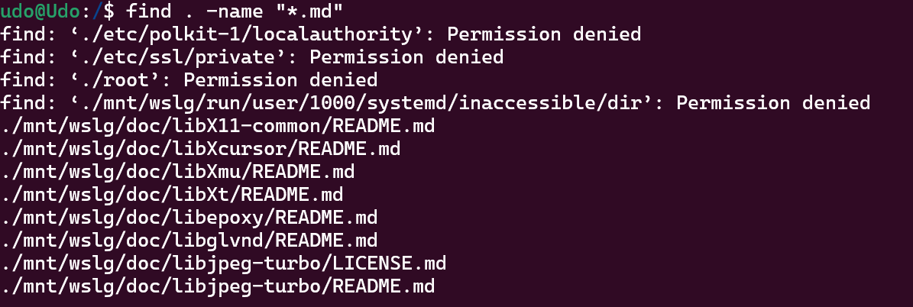
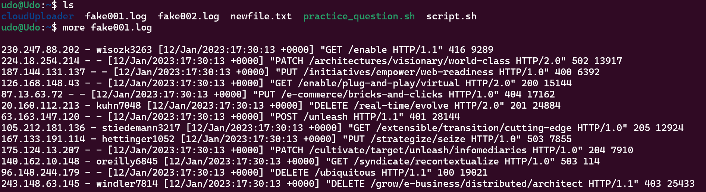
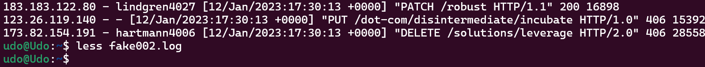
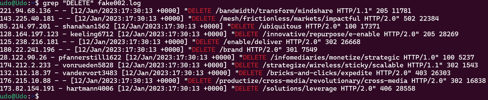
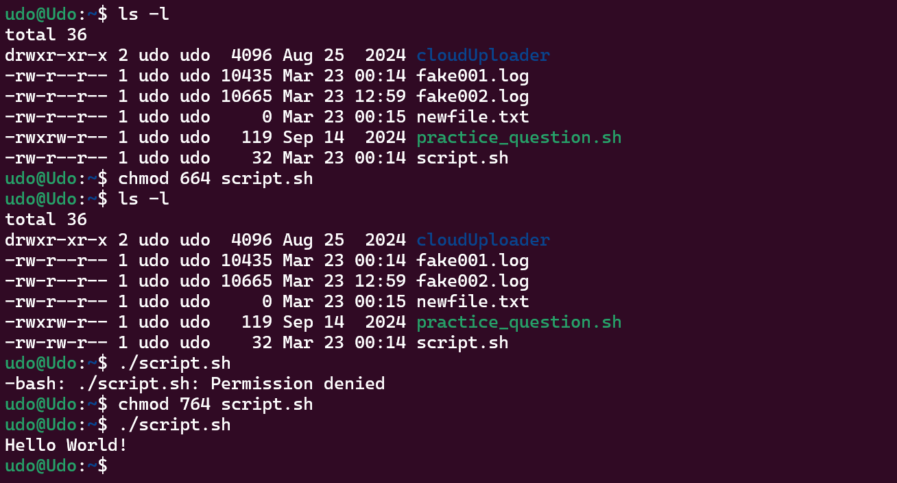
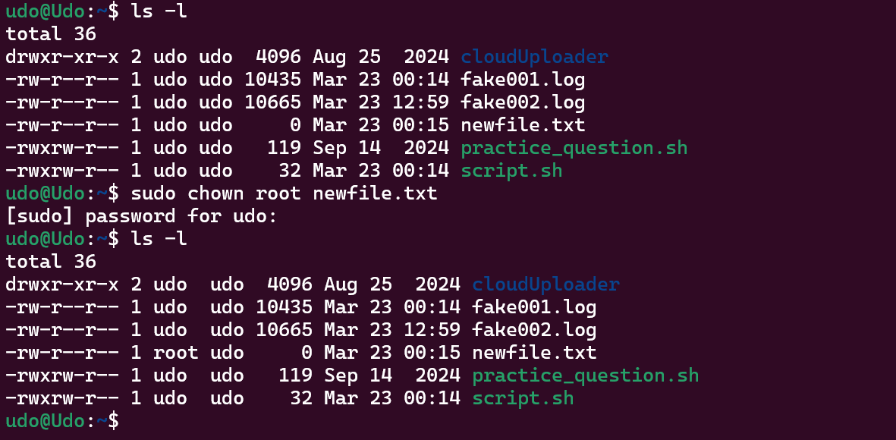
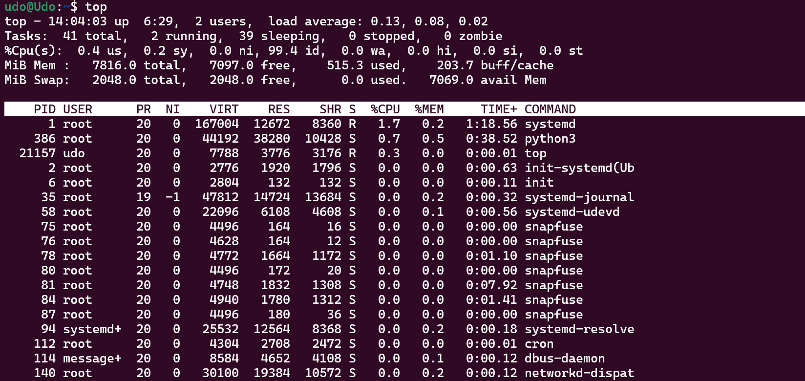
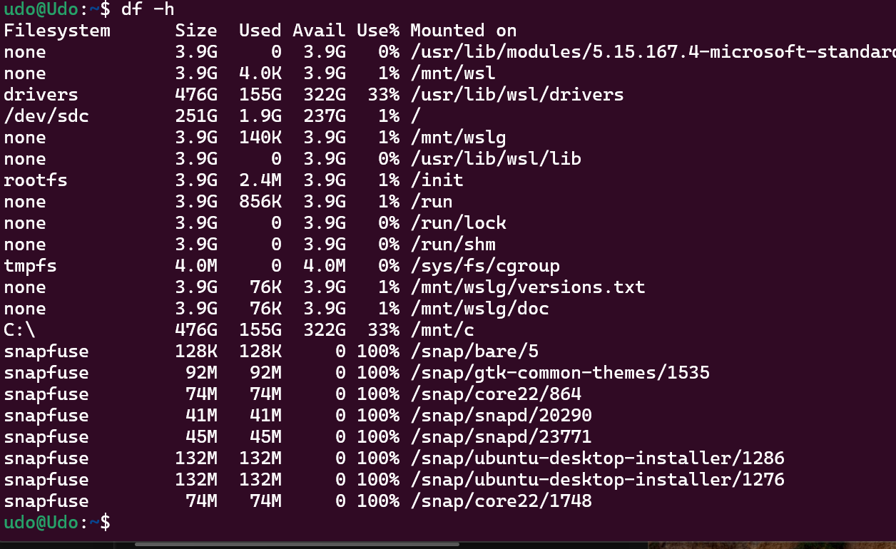

1. find command. This command returns all files, directories in the search result as regards how it is used. Example; find . -name "*.md" (this locates files with extension .md in the current directory)

1. more command. It returns information in a file page by page. Example; more fake001.log   

1. less command. The less command is used when searching for words or navigating the file. Examples; less fake002.log  

1. grep command. It searches for pattern in a file. Example; grep "DELETE" fake002.log   

1. echo command. Echo prints text to the the terminal or writes text to a file. Example; echo "Hello World". 

1. chmod command. This changes the file or directory permissions. Example; chmod 664 script.sh (6 for owners, 6 for groups, 4 for others).  

2. chown command. Chown changes owner & group owner of a file. Example; sudo chown root newfile.txt (this changes newfile.txt owner to root) 

3. top command. Top displays info about running processes and system resource usage. Example; top   

4. df command. Df dsiplays disk storage usage. Example; df -h (human readable format)   

5. kill command. Kill terminates a process by its process ID. Example; kill 1234    
